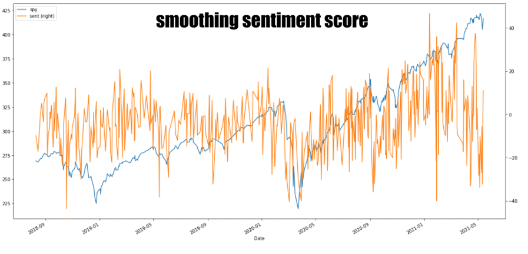
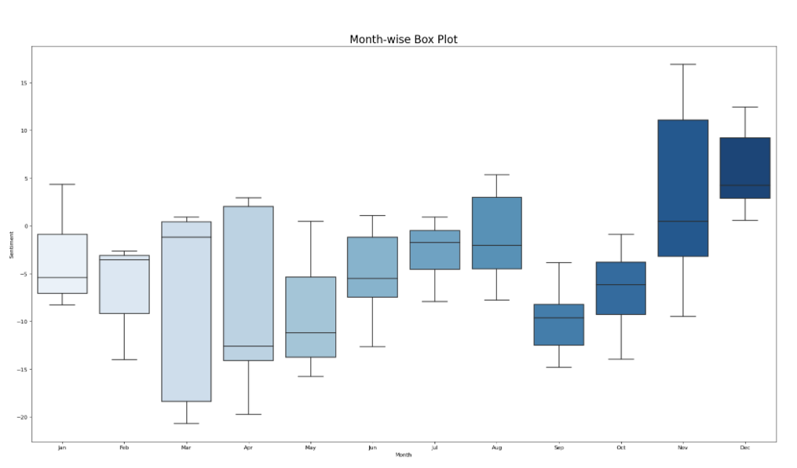
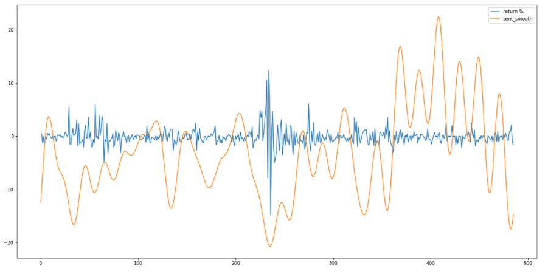
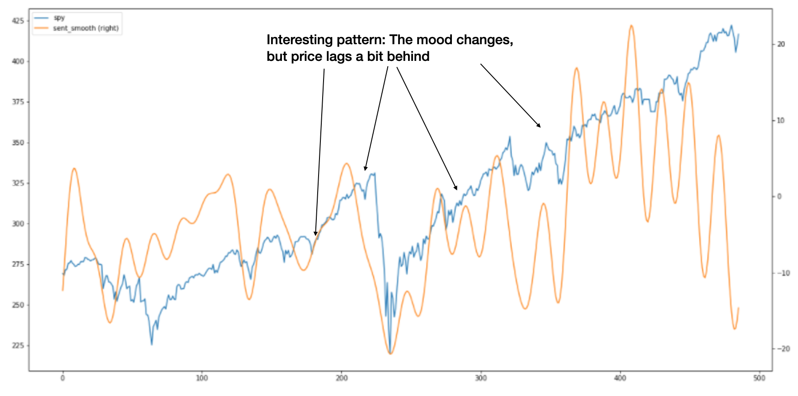

# Reddit-Stock-Effect-Analysis
A Data Science Case Study: Testing Correlation between Reddit Sentiment and Stock Prices

## Introduction 
This case study was inspired by events that happened in 2021. The full story can be read [here](https://theprint.in/theprint-essential/the-gamestop-story-how-a-group-of-investors-on-reddit-gave-wall-street-a-wild-week/595181/).

In summary, Reddit investors dramatically increased stocks like GameStop (GME) by up to 8000% over six months causing chaos on Wall Street.

The central question behind this case study is determining if there is a correlation between stock prices and Reddit sentiment. 

This includes at both the level of individual stocks and the overall market. 

## Method and Approach
* Extract Reddit comments from the Wallstreetbets subreddit using Pushift and Reddit API
* Get sentiment score for stock tickers from comments using the VADER library in NLTK
* Aggregate sentiment scores for individual stock tickers to create overall market sentiment score in pandas
* Plot aggregated sentiment scores against the SPY index to investigate the relationship

## Insights 

### Yearly Study 
Three years (2018-2021) of comment history from daily posts in the popular stock market subreddit "Wallstreetbets" was collected. 
A sentiment score was then calculated for each comment and aggregated to create an overall market sentiment score for each day. 
A Fourier transformation was used to smoothen the sentiment score. 

Some patterns are appearing in the monthly market sentiment score
* The highest sentiment is observed towards the end of the year
* A regular drop in sentiment appears over the late summer months in August and September
* The months of March and April have the largest variation due to the appearance of Covid affecting the economy

* The market returns and Reddit sentiment are only correlated when returns are at extreme levels
  

* The index price appears to be lagging behind Reddit sentiment which suggests that the mood of market participants changes before the price does

## Next Steps 
* Compare individual stocks against their sentiment on Reddit
* Test trading strategies
* Scrap more data 

